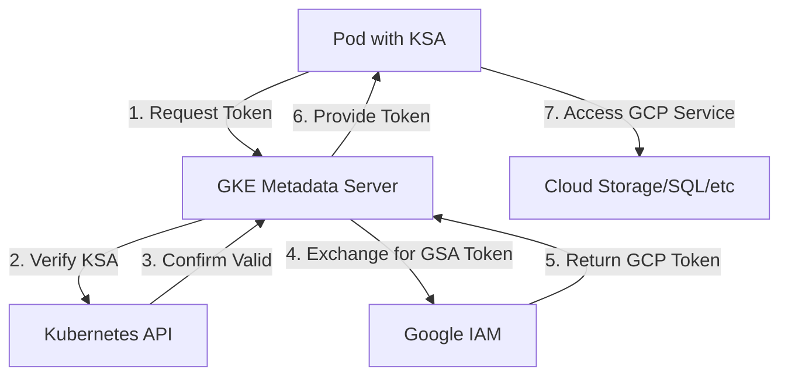

# GCP Workload Identity: The Complete Guide 🔐

## Table of Contents
- [Introduction: The Hotel Keycard Analogy](#introduction-the-hotel-keycard-analogy)
- [What is Workload Identity?](#what-is-workload-identity)
- [Why Does Workload Identity Exist?](#why-does-workload-identity-exist)
- [How Workload Identity Works](#how-workload-identity-works)
- [Real-World Implementation Scenarios](#real-world-implementation-scenarios)
- [Setting Up Workload Identity Step-by-Step](#setting-up-workload-identity-step-by-step)
- [Advanced Use Cases](#advanced-use-cases)
- [Best Practices](#best-practices)
- [Troubleshooting Common Issues](#troubleshooting-common-issues)
- [Security Benefits](#security-benefits)
- [Quick Reference](#quick-reference)

## Introduction: The Hotel Keycard Analogy 🏨

Imagine you're staying at a hotel:

**Traditional Approach (Service Account Keys):**
- You get a physical master key that opens everything
- If you lose it, anyone who finds it can access your room
- You have to carry it everywhere
- If stolen, you must change all locks

**Workload Identity Approach:**
- You get a smart keycard linked to your identity
- The card only works while you're a registered guest
- If lost, it can be instantly deactivated
- No physical key to steal or manage

This is exactly what Workload Identity does for your applications in GKE!

## What is Workload Identity? 🤔

**In Simple Terms:**
Workload Identity is Google's recommended way to let your applications running in GKE (Google Kubernetes Engine) access other Google Cloud services securely without managing any keys or secrets.

**Technical Definition:**
Workload Identity allows Kubernetes Service Accounts (KSAs) to act as Google Service Accounts (GSAs), enabling pods to authenticate as a specific Google Service Account without storing any credentials.

### The Two Types of Service Accounts working 

1. **Kubernetes Service Account (KSA)** 
   - Lives inside your Kubernetes cluster
   - Used by pods to identify themselves within the cluster
   - Example: `my-app-ksa` in namespace `production`

2. **Google Service Account (GSA)**
   - Lives in Google Cloud
   - Has permissions to access GCP resources
   - Example: `my-app-gsa@project-id.iam.gserviceaccount.com`

Workload Identity creates a bridge between these two! 🌉

## Why Does Workload Identity Exist? 🎯

### The Problems with Traditional Approaches

#### 1. Service Account Key Files (The Old Way) 📁
```bash
# Creating a key file (DON'T DO THIS!)
gcloud iam service-accounts keys create key.json \
    --iam-account=my-service@project.iam.gserviceaccount.com

# Using it in a pod (SECURITY RISK!)
kubectl create secret generic sa-key --from-file=key.json
```

**Problems:**
- Keys can be accidentally committed to Git
- Keys can be stolen from containers
- Keys never expire automatically
- Keys can be copied and used anywhere
- Managing key rotation is a nightmare

#### 2. Node Service Account (Also Problematic) 🖥️
- All pods on a node share the same identity
- Over-privileged access (pods get more permissions than needed)
- No granular control per application

### Enter Workload Identity! 🎉

**Benefits:**
- ✅ No keys to manage or rotate
- ✅ Automatic credential rotation
- ✅ Fine-grained access control per pod
- ✅ Follows principle of least privilege
- ✅ Audit logs show which pod accessed what
- ✅ Works seamlessly with existing IAM

## How Workload Identity Works 🔧

### The Magic Behind the Scenes



**Step-by-Step Process:**
1. Your pod (with a KSA) tries to access a GCP service
2. The GKE metadata server intercepts the request
3. It verifies the pod's Kubernetes Service Account
4. It exchanges the KSA identity for a GSA token
5. The pod receives a short-lived token
6. The pod uses this token to access GCP services
7. Token automatically refreshes before expiry

## Real-World Implementation Scenarios 🌍

### Scenario 1: GKE Application Accessing Cloud Storage 🪣

**Use Case:** Your e-commerce app needs to store product images in Cloud Storage

```bash
# Step 1: Create a Google Service Account
gcloud iam service-accounts create product-image-uploader \
    --display-name="Product Image Uploader"

# Step 2: Grant permissions to access Cloud Storage
gcloud projects add-iam-policy-binding PROJECT_ID \
    --member="serviceAccount:product-image-uploader@PROJECT_ID.iam.gserviceaccount.com" \
    --role="roles/storage.objectAdmin" \
    --condition="expression=resource.name.startsWith('projects/_/buckets/product-images'),title=product-images-only"

# Step 3: Create Kubernetes Service Account
kubectl create serviceaccount product-app-ksa -n production

# Step 4: Link KSA to GSA
kubectl annotate serviceaccount product-app-ksa \
    -n production \
    iam.gke.io/gcp-service-account=product-image-uploader@PROJECT_ID.iam.gserviceaccount.com

# Step 5: Allow KSA to impersonate GSA
gcloud iam service-accounts add-iam-policy-binding \
    product-image-uploader@PROJECT_ID.iam.gserviceaccount.com \
    --role=roles/iam.workloadIdentityUser \
    --member="serviceAccount:PROJECT_ID.svc.id.goog[production/product-app-ksa]"

# Step 6: Use it in your deployment
```

**Deployment Example:**
```yaml
apiVersion: apps/v1
kind: Deployment
metadata:
  name: product-service
  namespace: production
spec:
  template:
    spec:
      serviceAccountName: product-app-ksa  # This is the magic line!
      containers:
      - name: app
        image: gcr.io/PROJECT_ID/product-service:latest
        env:
        - name: GOOGLE_CLOUD_PROJECT
          value: PROJECT_ID
```

**Application Code (Python):**
```python
from google.cloud import storage

# No credentials needed! Workload Identity handles it
client = storage.Client()
bucket = client.bucket('product-images')

def upload_product_image(image_data, product_id):
    blob = bucket.blob(f'products/{product_id}.jpg')
    blob.upload_from_string(image_data)
    return blob.public_url
```

### Scenario 2: Cloud SQL Proxy with Workload Identity 🗄️

**Use Case:** Your application needs secure database access without embedding passwords

```bash
# Step 1: Create GSA for database access
gcloud iam service-accounts create cloudsql-proxy \
    --display-name="Cloud SQL Proxy Service Account"

# Step 2: Grant Cloud SQL client permissions
gcloud projects add-iam-policy-binding PROJECT_ID \
    --member="serviceAccount:cloudsql-proxy@PROJECT_ID.iam.gserviceaccount.com" \
    --role="roles/cloudsql.client"

# Step 3: Create KSA
kubectl create serviceaccount cloudsql-proxy-ksa -n production

# Step 4: Bind KSA to GSA
kubectl annotate serviceaccount cloudsql-proxy-ksa \
    -n production \
    iam.gke.io/gcp-service-account=cloudsql-proxy@PROJECT_ID.iam.gserviceaccount.com

gcloud iam service-accounts add-iam-policy-binding \
    cloudsql-proxy@PROJECT_ID.iam.gserviceaccount.com \
    --role=roles/iam.workloadIdentityUser \
    --member="serviceAccount:PROJECT_ID.svc.id.goog[production/cloudsql-proxy-ksa]"
```

**Deployment with Cloud SQL Proxy:**
```yaml
apiVersion: apps/v1
kind: Deployment
metadata:
  name: app-with-database
  namespace: production
spec:
  template:
    spec:
      serviceAccountName: cloudsql-proxy-ksa
      containers:
      - name: app
        image: gcr.io/PROJECT_ID/my-app:latest
        env:
        - name: DATABASE_HOST
          value: "127.0.0.1"
        - name: DATABASE_PORT
          value: "5432"
      
      # Cloud SQL Proxy sidecar
      - name: cloud-sql-proxy
        image: gcr.io/cloudsql-docker/gce-proxy:latest
        command:
          - "/cloud_sql_proxy"
          - "-instances=PROJECT_ID:REGION:INSTANCE_NAME=tcp:5432"
          - "-enable_iam_login"  # Use IAM authentication
```

### Scenario 3: GitHub Actions with Workload Identity Federation 🚀

**Use Case:** Deploy to GKE from GitHub Actions without storing credentials

```bash
# Step 1: Create Workload Identity Pool
gcloud iam workload-identity-pools create github-pool \
    --location="global" \
    --display-name="GitHub Actions Pool"

# Step 2: Create Workload Identity Provider
gcloud iam workload-identity-pools providers create-oidc github-provider \
    --location="global" \
    --workload-identity-pool="github-pool" \
    --issuer-uri="https://token.actions.githubusercontent.com" \
    --attribute-mapping="google.subject=assertion.sub,attribute.repository=assertion.repository" \
    --display-name="GitHub Provider"

# Step 3: Create GSA for GitHub Actions
gcloud iam service-accounts create github-deployer \
    --display-name="GitHub Actions Deployer"

# Step 4: Grant permissions
gcloud projects add-iam-policy-binding PROJECT_ID \
    --member="serviceAccount:github-deployer@PROJECT_ID.iam.gserviceaccount.com" \
    --role="roles/container.developer"

# Step 5: Allow GitHub to impersonate GSA
gcloud iam service-accounts add-iam-policy-binding \
    github-deployer@PROJECT_ID.iam.gserviceaccount.com \
    --role="roles/iam.workloadIdentityUser" \
    --member="principalSet://iam.googleapis.com/projects/PROJECT_NUMBER/locations/global/workloadIdentityPools/github-pool/attribute.repository/YOUR_GITHUB_ORG/YOUR_REPO"
```

**GitHub Actions Workflow:**
```yaml
name: Deploy to GKE
on:
  push:
    branches: [main]

jobs:
  deploy:
    runs-on: ubuntu-latest
    permissions:
      id-token: write
      contents: read
    
    steps:
    - uses: actions/checkout@v3
    
    - id: auth
      uses: google-github-actions/auth@v1
      with:
        workload_identity_provider: 'projects/PROJECT_NUMBER/locations/global/workloadIdentityPools/github-pool/providers/github-provider'
        service_account: 'github-deployer@PROJECT_ID.iam.gserviceaccount.com'
    
    - name: Set up Cloud SDK
      uses: google-github-actions/setup-gcloud@v1
    
    - name: Deploy to GKE
      run: |
        gcloud container clusters get-credentials CLUSTER_NAME --region=REGION
        kubectl apply -f k8s/
```

## Setting Up Workload Identity Step-by-Step 📋

### Prerequisites
1. GKE cluster with Workload Identity enabled
2. `gcloud` CLI configured
3. `kubectl` access to your cluster

### Complete Setup Guide

```bash
# 1. Enable Workload Identity on your cluster (if not already enabled)
gcloud container clusters update CLUSTER_NAME \
    --workload-pool=PROJECT_ID.svc.id.goog \
    --region=REGION

# 2. Create or update node pool with Workload Identity
gcloud container node-pools update NODE_POOL_NAME \
    --cluster=CLUSTER_NAME \
    --workload-metadata=GKE_METADATA \
    --region=REGION

# 3. Create namespace
kubectl create namespace my-app

# 4. Create Google Service Account
gcloud iam service-accounts create my-app-gsa \
    --display-name="My App Service Account"

# 5. Grant necessary permissions
gcloud projects add-iam-policy-binding PROJECT_ID \
    --member="serviceAccount:my-app-gsa@PROJECT_ID.iam.gserviceaccount.com" \
    --role="roles/storage.objectViewer"

# 6. Create Kubernetes Service Account
kubectl create serviceaccount my-app-ksa -n my-app

# 7. Annotate KSA with GSA
kubectl annotate serviceaccount my-app-ksa \
    -n my-app \
    iam.gke.io/gcp-service-account=my-app-gsa@PROJECT_ID.iam.gserviceaccount.com

# 8. Create IAM binding
gcloud iam service-accounts add-iam-policy-binding \
    my-app-gsa@PROJECT_ID.iam.gserviceaccount.com \
    --role=roles/iam.workloadIdentityUser \
    --member="serviceAccount:PROJECT_ID.svc.id.goog[my-app/my-app-ksa]"

# 9. Verify setup
kubectl run test-pod \
    --image=google/cloud-sdk:slim \
    --serviceaccount=my-app-ksa \
    -n my-app \
    --rm -it \
    -- gcloud auth list
```

## Advanced Use Cases 🔥

### 1. Multi-Project Access
```bash
# GSA in Project A accessing resources in Project B
gcloud projects add-iam-policy-binding PROJECT_B \
    --member="serviceAccount:my-app-gsa@PROJECT_A.iam.gserviceaccount.com" \
    --role="roles/bigquery.dataViewer"
```

### 2. Cross-Cluster Workload Identity
```yaml
# Using Anthos Service Mesh for multi-cluster
apiVersion: security.istio.io/v1beta1
kind: AuthorizationPolicy
metadata:
  name: cross-cluster-access
spec:
  selector:
    matchLabels:
      app: backend
  rules:
  - from:
    - source:
        principals: ["cluster.local/ns/frontend/sa/frontend-ksa"]
```

### 3. Conditional IAM Bindings
```bash
# Time-based access
gcloud projects add-iam-policy-binding PROJECT_ID \
    --member="serviceAccount:temp-access@PROJECT_ID.iam.gserviceaccount.com" \
    --role="roles/storage.admin" \
    --condition="expression=request.time < timestamp('2024-12-31T00:00:00Z'),title=temporary-access"
```

## Best Practices 🌟

### 1. Naming Conventions
```bash
# Use consistent naming
GSA: [app-name]-gsa@[project].iam.gserviceaccount.com
KSA: [app-name]-ksa
Namespace: [environment] (production, staging, dev)
```

### 2. Least Privilege Principle
```bash
# ❌ Bad: Too broad
--role="roles/owner"

# ✅ Good: Specific permissions
--role="roles/storage.objectViewer"
--condition="expression=resource.name.startsWith('projects/_/buckets/app-data')"
```

### 3. Separate Service Accounts per App
```yaml
# ❌ Bad: Shared service account
serviceAccountName: default

# ✅ Good: App-specific service account
serviceAccountName: order-processor-ksa
```

### 4. Use IAM Conditions
```bash
# Restrict to specific resources
gcloud projects add-iam-policy-binding PROJECT_ID \
    --member="serviceAccount:app@PROJECT_ID.iam.gserviceaccount.com" \
    --role="roles/storage.objectAdmin" \
    --condition="expression=resource.name.startsWith('projects/_/buckets/app-specific-bucket'),title=app-bucket-only"
```

## Troubleshooting Common Issues 🔧

### Issue 1: "Permission Denied" Errors

**Check 1: Verify KSA annotation**
```bash
kubectl get serviceaccount my-app-ksa -n my-app -o yaml
# Look for: iam.gke.io/gcp-service-account annotation
```

**Check 2: Verify IAM binding**
```bash
gcloud iam service-accounts get-iam-policy \
    my-app-gsa@PROJECT_ID.iam.gserviceaccount.com
# Should show workloadIdentityUser binding
```

**Check 3: Test from pod**
```bash
kubectl run -it --rm debug \
    --image=google/cloud-sdk:slim \
    --serviceaccount=my-app-ksa \
    -n my-app \
    --restart=Never \
    -- /bin/bash

# Inside pod:
gcloud auth list
gcloud config list
curl -H "Metadata-Flavor: Google" \
    http://metadata.google.internal/computeMetadata/v1/instance/service-accounts/default/email
```

### Issue 2: "Workload Identity not enabled"

```bash
# Check cluster configuration
gcloud container clusters describe CLUSTER_NAME \
    --region=REGION \
    --format="value(workloadIdentityConfig.workloadPool)"

# Should output: PROJECT_ID.svc.id.goog
```

### Issue 3: Token Exchange Failures

```bash
# Check pod logs
kubectl logs POD_NAME -n NAMESPACE

# Check GKE metadata server logs
kubectl logs -n kube-system -l component=gke-metadata-server
```

## Security Benefits 🛡️

### 1. No Credential Storage
- ✅ No keys in containers
- ✅ No keys in CI/CD systems
- ✅ No keys in version control

### 2. Automatic Rotation
- Tokens expire after 1 hour
- Automatic refresh without downtime
- No manual rotation needed

### 3. Detailed Audit Logs
```bash
# View who accessed what
gcloud logging read \
    'resource.type="k8s_cluster" 
     protoPayload.methodName="io.k8s.core.v1.serviceaccounts.token"'
```

### 4. Blast Radius Limitation
- Compromised pod = limited access
- Can't use credentials outside cluster
- Easy to revoke access

## Quick Reference 📚

### Essential Commands Cheatsheet

```bash
# Create GSA
gcloud iam service-accounts create GSA_NAME

# Create KSA
kubectl create serviceaccount KSA_NAME -n NAMESPACE

# Annotate KSA
kubectl annotate serviceaccount KSA_NAME \
    -n NAMESPACE \
    iam.gke.io/gcp-service-account=GSA_NAME@PROJECT_ID.iam.gserviceaccount.com

# Create binding
gcloud iam service-accounts add-iam-policy-binding \
    GSA_NAME@PROJECT_ID.iam.gserviceaccount.com \
    --role=roles/iam.workloadIdentityUser \
    --member="serviceAccount:PROJECT_ID.svc.id.goog[NAMESPACE/KSA_NAME]"

# Test access
kubectl run -it --rm test \
    --image=google/cloud-sdk:slim \
    --serviceaccount=KSA_NAME \
    -n NAMESPACE \
    -- gcloud auth list
```

### Common IAM Roles

| Service | Common Roles |
|---------|--------------|
| Cloud Storage | `roles/storage.objectViewer`, `roles/storage.objectAdmin` |
| BigQuery | `roles/bigquery.dataViewer`, `roles/bigquery.dataEditor` |
| Cloud SQL | `roles/cloudsql.client`, `roles/cloudsql.editor` |
| Pub/Sub | `roles/pubsub.subscriber`, `roles/pubsub.publisher` |
| Secret Manager | `roles/secretmanager.secretAccessor` |
| Cloud Build | `roles/cloudbuild.builds.editor` |
| GKE | `roles/container.developer` |

### Architecture Decision Record

```markdown
# ADR: Adopting Workload Identity

## Status
Accepted

## Context
- Managing service account keys is error-prone
- Security audits flagged key management issues
- Need fine-grained access control per application

## Decision
Implement Workload Identity for all GKE workloads

## Consequences
✅ Eliminated key management overhead
✅ Improved security posture
✅ Better audit trails
❌ Initial setup complexity
❌ Requires GKE (not portable to other k8s)
```

## Summary: When to Use Workload Identity 🎯

**Use Workload Identity when:**
- ✅ Running workloads on GKE
- ✅ Need to access GCP services from pods
- ✅ Want to eliminate credential management
- ✅ Require fine-grained access control
- ✅ Need detailed audit trails
- ✅ Following security best practices

**Don't use Workload Identity when:**
- ❌ Not using GKE (use other cloud's equivalent)
- ❌ Only accessing non-GCP services
- ❌ Running simple workloads with no external access needs

## Next Steps 🚶

1. **Start Small**: Implement for one non-critical service first
2. **Document Everything**: Create runbooks for your team
3. **Automate Setup**: Use Terraform/Pulumi for consistency
4. **Monitor Usage**: Set up alerts for authentication failures
5. **Regular Audits**: Review IAM bindings quarterly

Remember: Workload Identity is like having a smart security system that knows exactly who should access what, when, and from where - all without you managing a single key! 🎉

---

*Last Updated: December 2024*
*Contributors: Your DevOps Team*
*Questions? Reach out on #platform-team Slack channel*